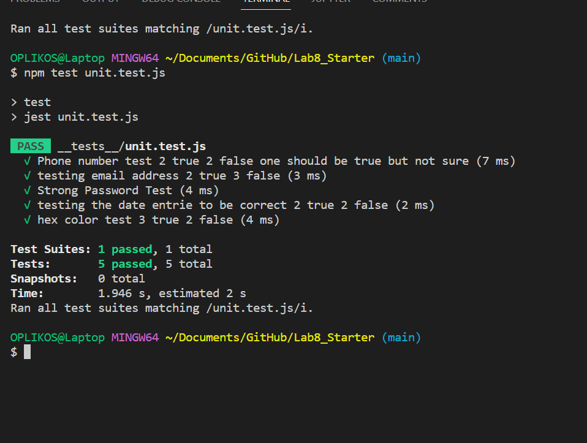
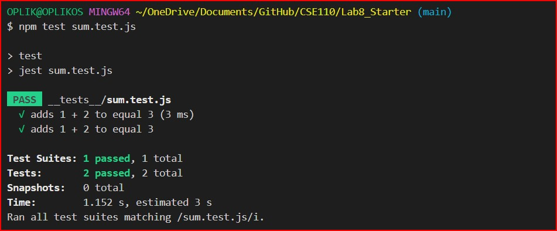
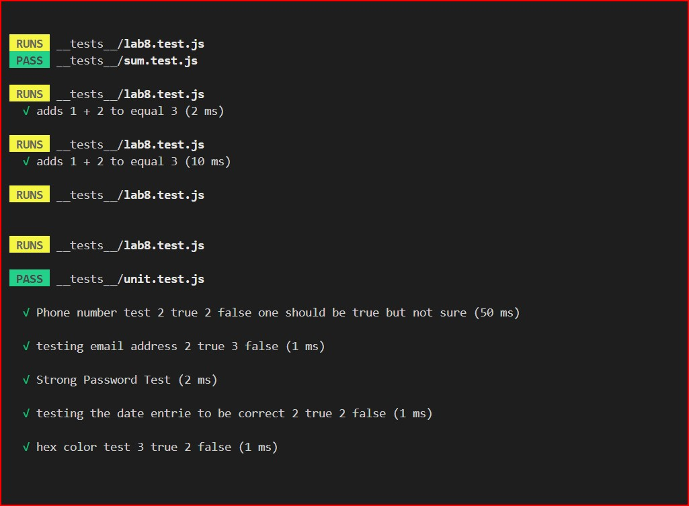
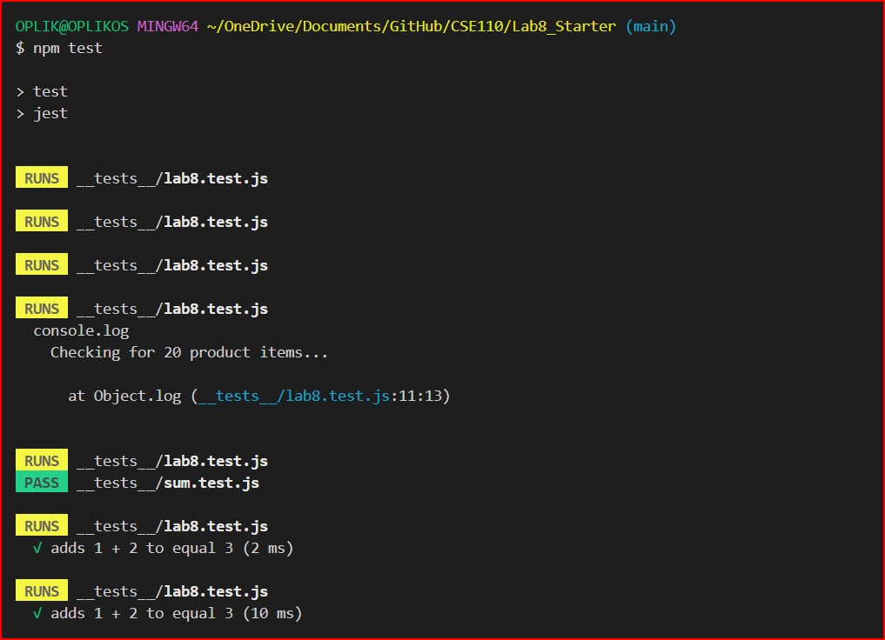
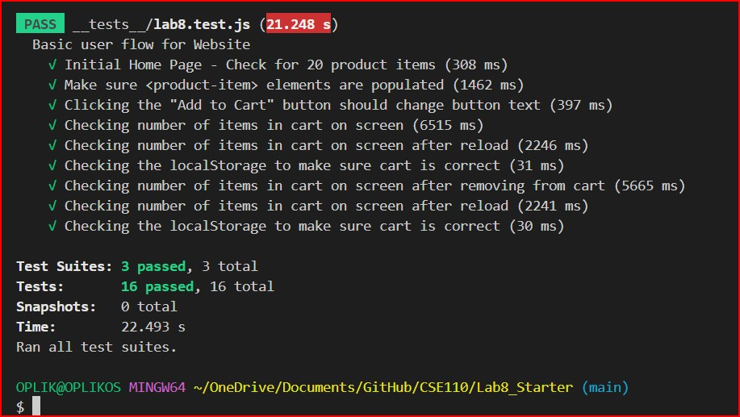

# Lab 8 - Starter
 
 - [x] Sarkis Bouzikian
 - [ ] Dante

## Question 1

1. Where would you fit your automated tests in your Recipe project development pipeline? Select one of the following and explain why.

   1. Within a Github action that runs whenever code is pushed 
   2. Manually run them locally before pushing code
   3. Run them all after all development is completed

## Answer

1. Within a Github action that runs whenever code is pushed, to insure the perfect testing and use the build in automatic testing on the go to insure the code is working properlyand correctly 
*> **"way for developers to automate test cases that involve emulating user actions"***

## Question 2

2. Would you use an end to end test to check if a function is returning the correct output? (yes/no)

## Answer

NO

## Question 3

3. Would you use a unit test to test the “message” feature of a messaging application? Why or why not? For this question, assume the “message” feature allows a user to write and send a message to another user.

## Answer

no because messages is dynamic the uinit test is use to test something specific to see if it maches the parameter but not for a message that changes and/or  has no restiction to it

## Question 4

4. Would you use a unit test to test the “max message length” feature of a messaging application? Why or why not? For this question, assume the “max message length” feature prevents the user from typing more than 80 characters.

## Answer

yes unite test will be able to test the lenght of message and thats because the lenght of the messages in fix and can be passed and test.

---
---

[lab link](https://oplikos.github.io/Lab8_Starter/)

